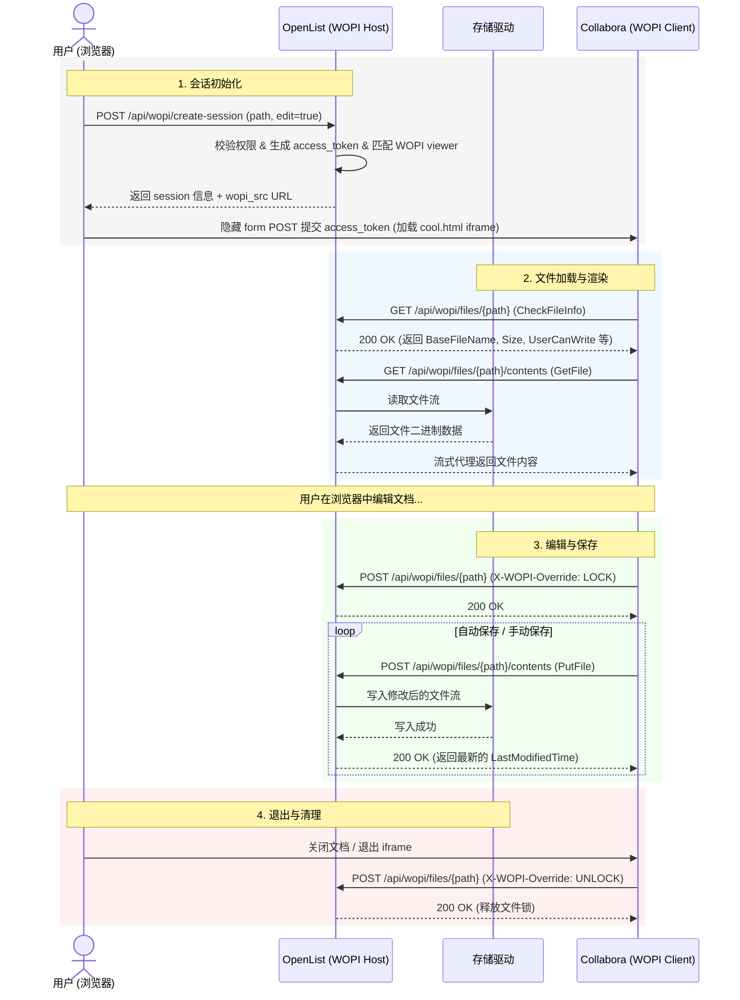

# WOPI 集成文档

## 概述

WOPI (Web Application Open Platform Interface) 是 Microsoft 定义的协议，允许 Web 应用（如 Collabora Online、OnlyOffice）在线查看和编辑 Office 文档。

OpenList 通过 WOPI 协议集成了在线 Office 编辑能力，支持同时配置多个 WOPI 服务。

## 架构

```
┌──────────────┐     ┌──────────────┐     ┌──────────────────┐
│   浏览器      │────▶│   OpenList   │────▶│  Collabora /      │
│  (前端)       │◀────│   (WOPI Host)│◀────│  OnlyOffice       │
│              │     │              │     │  (WOPI Client)    │
└──────────────┘     └──────────────┘     └──────────────────┘
                           │
                           ▼
                     ┌──────────────┐
                     │ 存储驱动      │
                     │ (本地/S3/...) │
                     └──────────────┘
```

### 工作流程



1. 用户在 OpenList 前端打开一个 Office 文件
2. 前端检测到 WOPI 已启用且该扩展名有对应的 WOPI viewer
3. 前端调用 `POST /api/wopi/create-session` 创建 WOPI 会话
4. 后端生成 access_token，查找匹配的 WOPI viewer，返回 WOPI src URL
5. 前端通过隐藏 form POST 将 access_token 提交到 WOPI 服务的 iframe
6. WOPI 服务（Collabora/OnlyOffice）回调 OpenList 的 WOPI 标准端点获取/保存文件

## 配置

### 管理后台配置

进入 **管理后台 → 设置 → 预览 → WOPI**

| 设置项               | 说明                     | 默认值            |
| -------------------- | ------------------------ | ----------------- |
| `wopi_enabled`       | 启用/禁用 WOPI           | `false`           |
| `wopi_services`      | WOPI 服务配置 JSON       | `[]`              |
| `wopi_max_file_size` | 最大编辑文件大小（字节） | `52428800` (50MB) |

### 添加 WOPI 服务

1. 点击 **Add Service** 按钮
2. 填写 **服务名称**（如 "Collabora Online"）
3. 填写 **Discovery URL**（如 `http://collabora:9980/hosting/discovery`）
4. （可选）填写 **External URL** — 当 WOPI 服务运行在 Docker 中时，discovery XML 里的 URL 通常是容器内部 IP，浏览器无法访问。填写浏览器实际访问该服务的地址（如 `http://192.168.1.100:8080`），前端会自动替换 discovery XML 中的域名
5. 点击 **Import** 按钮
   - 前端会尝试直接 fetch discovery URL
   - 如果 CORS 拦截，会显示文本框让你手动粘贴 XML
6. 导入成功后会显示支持的扩展名列表
7. 点击 **Save** 保存

#### Discovery XML 示例

Collabora 的 discovery 端点返回形如以下的 XML，其中 `urlsrc` 即各扩展名对应的编辑器入口模板，`%s` 由 WOPI src 替换：

```xml
<wopi-discovery>
  <net-zone name="external-http">
    <app name="Writer">
      <action name="edit" ext="docx" default="true"
              urlsrc="http://collabora:9980/browser/.../cool.html?WOPISrc=%s&amp;lang=zh-cn"/>
      <action name="view" ext="docx"
              urlsrc="http://collabora:9980/browser/.../cool.html?WOPISrc=%s"/>
    </app>
  </net-zone>
</wopi-discovery>
```

OpenList 前端在 Import 时解析该 XML，按扩展名提取 `edit`/`view` 两个 action 的 `urlsrc`，填入 `wopi_services[].viewers`。

### `wopi_services` JSON 格式

```json
[
  {
    "name": "Collabora Online",
    "endpoint": "http://collabora:9980/hosting/discovery",
    "external_url": "http://192.168.1.100:9980",
    "viewers": {
      "docx": {
        "service_name": "Collabora Online",
        "display_name": "writer",
        "icon": "http://collabora:9980/browser/.../x-office-document.svg",
        "actions": {
          "edit": "http://collabora:9980/browser/.../cool.html",
          "view": "http://collabora:9980/browser/.../cool.html"
        }
      }
    }
  }
]
```

| 字段           | 说明                                                                                                                                 |
| -------------- | ------------------------------------------------------------------------------------------------------------------------------------ |
| `name`         | 服务名称，显示在预览选择器中                                                                                                         |
| `endpoint`     | WOPI discovery URL                                                                                                                   |
| `external_url` | **可选**。浏览器访问该服务的实际地址。当 WOPI 服务运行在 Docker 中时，discovery XML 返回的 URL 是容器内部 IP，前端会用此字段替换域名 |
| `viewers`      | Import 自动填充。`actions` 存储编辑器 base URL，前端使用时自行拼接 `WOPISrc`、`lang`、`thm` 等参数                                   |

## 部署 Collabora Online

### Docker 部署

```bash
docker run -d --name collabora \
  -p 9980:9980 \
  -e "aliasgroup1=http://.*:5244" \
  -e "extra_params=\
  --o:ssl.enable=false \
  --o:net.frame_ancestors=* \
  --o:welcome.enable=false" \
  -e "username=admin" \
  -e "password=strong_password" \
  --restart always \
  --cap-add MKNOD \
  --name collabora \
  collabora/code
```

### 配置说明

| 环境变量       | 说明                                   |
| -------------- | -------------------------------------- |
| `aliasgroup1`  | 允许的 WOPI 主机列表（正则，逗号分隔） |
| `extra_params` | 传给 coolwsd 的额外 `--o:` 参数        |
| `username`     | 管理后台用户名                         |
| `password`     | 管理后台密码                           |

> `aliasgroup1` 的值是正则表达式，`http://.*:5244` 表示允许任意主机名、端口为 5244 的 OpenList 实例作为 WOPI Host 回调。生产环境建议收紧为具体域名。

## API 端点

### 创建 WOPI 会话（需登录）

```
POST /api/wopi/create-session
Authorization: <JWT token>

{
  "path": "/documents/report.docx",
  "edit": true,
  "service": "Collabora Online"  // 可选
}
```

**响应：**

```json
{
  "code": 200,
  "data": {
    "session": {
      "id": "26453a4ad69633b6...",
      "access_token": "26453a4a...a8b75786...",
      "expires": 1782623577441,
      "path": "/documents/report.docx",
      "user_id": 1,
      "can_edit": true
    },
    "action_url": "http://collabora:9980/browser/.../cool.html",
    "wopi_src_url": "http://openlist:5244/api/wopi/files/documents/report.docx",
    "viewer": "writer",
    "service_name": "Collabora Online"
  }
}
```

**设计原则：后端不生成完整的预览 URL，只返回原始数据。** 前端负责拼接最终 URL 并注入语言、主题等参数。这样后端无需处理用户输入的 discovery URL 模板，也避免了不同 WOPI 服务 URL 格式差异（Collabora vs OnlyOffice）带来的兼容问题，方便处理lang、theme、darkmode等前端状态。

### 前端 URL 构建

前端拿到 `action_url` 和 `wopi_src_url` 后，自行拼接最终的编辑器 URL：

```typescript
const lang = navigator.language?.toLowerCase() ?? "en"
const darkMode = colorMode() === "dark" ? "2" : "1"
const params = new URLSearchParams({
  WOPISrc: data.wopi_src_url, // 必填：WOPI 回调地址
  lang: lang, // UI 语言 (RFC1766)
  ui: lang, // OnlyOffice UI 语言
  thm: darkMode, // 主题：1=浅色 2=深色
})
const editorUrl = data.action_url + "?" + params.toString()
```

然后构造一个隐藏 form，以 POST 方式提交 `access_token` 到 `editorUrl`，目标为 iframe。这样 token 不会出现在浏览器历史/Referer 中，比拼接到 URL 查询参数更安全。

### WOPI REST API 实现状态

参考 [OnlyOffice WOPI REST API 文档](https://api.onlyoffice.com/zh-CN/docs/docs-api/using-wopi/wopi-rest-api/)：

| 操作                | 方法   | 路径                              | 状态      | 说明                                 |
| ------------------- | ------ | --------------------------------- | --------- | ------------------------------------ |
| **CheckFileInfo**   | `GET`  | `/api/wopi/files/{path}`          | ✅ 已实现 | 返回文件元信息、权限、主机能力       |
| **GetFile**         | `GET`  | `/api/wopi/files/{path}/contents` | ✅ 已实现 | 流式代理（非重定向），兼容 S3 等存储 |
| **PutFile**         | `POST` | `/api/wopi/files/{path}/contents` | ✅ 已实现 | 写入文件内容，检查大小限制           |
| **Lock**            | `POST` | `/api/wopi/files/{path}`          | ✅ 已实现 | 按路径加锁，支持冲突检测             |
| **Unlock**          | `POST` | `/api/wopi/files/{path}`          | ✅ 已实现 | 释放锁，验证 token 匹配              |
| **RefreshLock**     | `POST` | `/api/wopi/files/{path}`          | ✅ 已实现 | 刷新锁计时器（30 分钟）              |
| **PutRelativeFile** | `POST` | `/api/wopi/files/{path}`          | ✅ 已实现 | 另存为，验证同目录 + 文件名合法性    |
| **RenameFile**      | `POST` | `/api/wopi/files/{path}`          | ❌ 未实现 | 重命名文件                           |
| **DeleteFile**      | `POST` | `/api/wopi/files/{path}`          | ❌ 未实现 | 删除文件（WOPI 可选操作）            |
| **GetLock**         | `POST` | `/api/wopi/files/{path}`          | ❌ 未实现 | 获取当前锁状态                       |

认证方式：`?access_token=<token>` 查询参数

#### CheckFileInfo 返回字段

| 类别            | 字段                                                                                                               | 说明           |
| --------------- | ------------------------------------------------------------------------------------------------------------------ | -------------- |
| **必需**        | `BaseFileName`, `Size`, `Version`                                                                                  | 文件基本信息   |
| **用户元数据**  | `UserId`, `UserFriendlyName`, `IsAnonymousUser`, `OwnerId`                                                         | 用户标识       |
| **用户权限**    | `ReadOnly`, `UserCanWrite`, `UserCanRename`, `UserCanReview`, `UserCanNotWriteRelative`                            | 读写权限       |
| **主机能力**    | `SupportsLocks`, `SupportsGetLock`, `SupportsUpdate`, `SupportsRename`, `SupportsReviewing`                        | 主机支持的操作 |
| **PostMessage** | `ClosePostMessage`, `EditModePostMessage`, `FileSharingPostMessage`, `FileVersionPostMessage`, `PostMessageOrigin` | iframe 通信    |
| **面包屑**      | `BreadcrumbBrandName`, `BreadcrumbBrandUrl`, `BreadcrumbFolderName`, `BreadcrumbFolderUrl`                         | 导航路径       |
| **其他**        | `FileExtension`, `FileNameMaxLength`, `LastModifiedTime`, `DisablePrint`                                           | 杂项           |

### 获取 WOPI 设置（需登录）

```
GET /api/wopi/settings
Authorization: <JWT token>
```

## Discovery 参数参考

根据 [WOPI 标准](https://api.onlyoffice.com/zh-CN/docs/docs-api/using-wopi/wopi-discovery/)，`urlsrc` 中支持以下发现查询参数：

| 参数          | 示例值                             | 说明                         |
| ------------- | ---------------------------------- | ---------------------------- |
| `wopisrc`     | `https://host/api/wopi/files/path` | **必填**。WOPI 回调地址      |
| `ui` / `lang` | `zh-cn`                            | UI 语言 (RFC1766)            |
| `rs`          | `zh-cn`                            | 数据语言（电子表格计算用）   |
| `thm`         | `1`                                | 主题：`1` = 浅色，`2` = 深色 |
| `dchat`       | `1`                                | 禁用聊天                     |
| `embed`       | `true`                             | 嵌入模式                     |

> OnlyOffice 和 Collabora 的 `urlsrc` 模板格式不同。前端只提取 base URL（`?` 之前的部分），然后自行拼接参数，不依赖模板中的占位符格式。

## 前端预览器

### 预览优先级

WOPI 预览器的优先级高于所有内置预览器。当 WOPI 启用且文件扩展名匹配时，WOPI 会是默认选中的预览器。

预览顺序：

1. **WOPI**（每个服务独立显示，如 "Collabora Online"）
2. 内置预览器（ppt、xls、doc 等）
3. iframe 预览器
4. Download

### 支持的文件类型

支持的扩展名由 WOPI 服务的 discovery XML 决定。Collabora Online 默认支持：

- **Word**: doc, docx, docm, dot, dotx, odt, rtf, txt
- **Excel**: xls, xlsx, xlsm, xlt, xltx, csv, ods
- **PowerPoint**: ppt, pptx, pptm, pot, potx, odp
- **其他**: pdf, epub, html, xml 等

### 文件锁

- 按文件路径加锁，30 分钟自动过期
- LOCK 时如果已被其他 token 锁定，返回 409 Conflict
- UNLOCK 时验证 token 匹配

## 文件代理

WOPI GetFile 端点始终使用**流式代理**，不使用 302 重定向。

原因：S3 等存储服务的预签名 URL 包含认证信息，如果 302 重定向到 S3，WOPI 服务（Collabora）跟随重定向时会带上自己的认证头，导致 "only one auth mechanism allowed" 错误。

代理流程：

```
Collabora → GET /api/wopi/files/{path}/contents
         → OpenList 从存储驱动获取文件流
         → 流式转发给 Collabora
```

## 故障排查

| 现象                                              | 可能原因                                                | 排查方向                                                           |
| ------------------------------------------------- | ------------------------------------------------------- | ------------------------------------------------------------------ |
| iframe 白屏 / 控制台报 `frame-ancestors` CSP 错误 | Collabora 未放行 OpenList 域名                          | `extra_params` 加 `--o:net.frame_ancestors=你的域名` 或 `*`        |
| Collabora 日志报 `Unauthorized WOPI host`         | `aliasgroup1` 未匹配 OpenList 回调域名                  | 检查正则是否覆盖 OpenList 实际访问地址（含端口）                   |
| `WOPI::CheckFileInfo failed`                      | token 过期 / 路径不存在 / 权限不足                      | 看 OpenList 后端日志，确认 session 仍有效、路径规范化后一致        |
| `WOPI::GetFile failed`                            | 存储驱动取流失败 / 文件大小与 CheckFileInfo.Size 不符   | 校验 `Size` 字段与实际字节数；确认代理流式转发未中断               |
| 能打开但无法保存（按钮灰或保存即报错）            | `SupportsUpdate=false` 或 `UserCanWrite=false`          | 检查 CheckFileInfo 返回值；确认 session.can_edit=true              |
| 保存时 409 Conflict                               | 锁丢失或被他人持有                                      | 确认 LOCK/REFRESH_LOCK 实现正确；409 响应必须带 `X-WOPI-Lock`      |
| 另存为不可用                                      | `UserCanNotWriteRelative=true` 或未实现 PutRelativeFile | 设为 false 并实现 `X-WOPI-Override: PUT_RELATIVE                   |
| 中文字体缺失/方框                                 | 容器内缺中文字体                                        | 挂载字体目录并 `fc-cache -fv && coolconfig update-system-template` |
| 会话 30 分钟后断开                                | WOPI 会话过期                                           | 重新打开文件创建新会话                                             |

### CORS 错误

如果 Import 时浏览器报 CORS 错误：

1. 在浏览器新标签页打开 discovery URL
2. 全选复制页面源码
3. 粘贴到管理页面的文本框中
4. 点击 "Parse XML"

### CSP frame-ancestors 错误

浏览器控制台报 `violates Content Security Policy directive: "frame-ancestors ..."`：

- 需要修改 WOPI 服务的 CSP 配置，添加 OpenList 的域名
- Collabora: 修改 `coolwsd.xml` 的 `<frame_ancestors>` 或 `<content_security_policy>`

### 文件加载失败

Collabora 日志报 `WOPI::GetFile failed`：

- 检查 OpenList 后端日志
- 确认文件路径正确
- 确认 access_token 未过期
- 确认存储驱动正常工作

### 会话过期

WOPI 编辑器突然断开：

- 默认会话 30 分钟过期
- 过期后需要重新打开文件创建新会话
